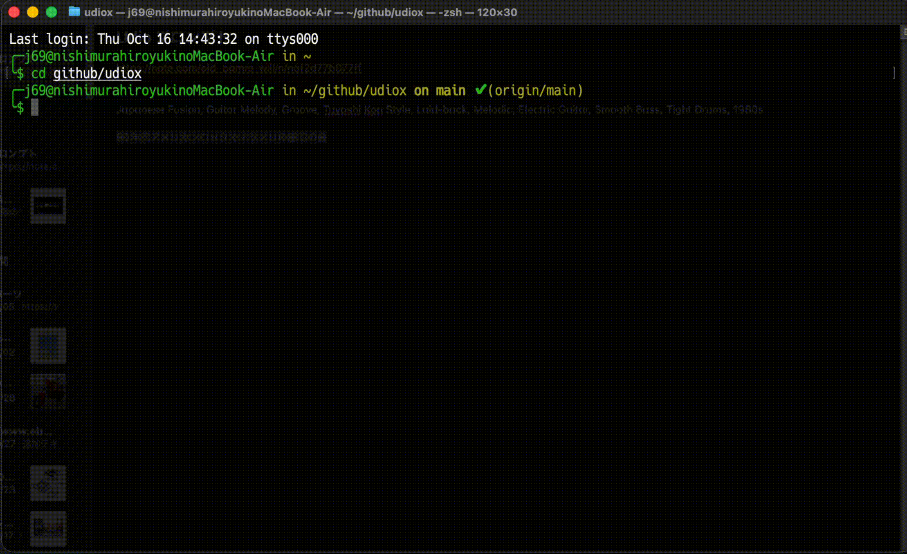

# UdioX

Udioのプロンプトエンジニアリングを支援するためのTypeScriptアプリケーションです。ユーザーが入力した楽曲のイメージから、Udio AI音楽生成プラットフォーム用の最適化されたプロンプトを生成します。



## セットアップ

### 1. 依存関係のインストール

```bash
npm install
```

### 2. 環境変数の設定

`.env`ファイルを作成して、OpenAI APIキーを設定してください：

```env
OPENAI_API_KEY='your_openai_api_key_here'
```

**注意:** OpenAI APIキーは[OpenAI Platform](https://platform.openai.com/api-keys)から取得できます。

### 3. TypeScriptのコンパイル

```bash
npm run build
```

## 使用方法

### 開発モード

```bash
npm run dev
```

### 本番モード

```bash
npm run prod
```

### 利用可能なモデル

アプリケーション起動時にモデルを選択できます：

* **gpt-5-mini** - GPT-5の小型版
* **gpt-5-nano** (デフォルト) - GPT-5の最小版
* **o4-mini** - o4の小型版
* **gpt-4.1-mini** - GPT-4.1の小型版
* **gpt-4.1-nano** - GPT-4.1の最小版

## プロジェクト構造

```
src/
├── index.ts         # アプリケーションのエントリーポイント
├── prompt.ts        # プロンプト生成クラス（Promptクラス）
├── types.ts         # TypeScript型定義とZodスキーマ
└── StructureData.md # プロンプトエンジニアリング用の構造データ
```

## 機能

* インタラクティブなモデル選択インターフェース
* 楽曲イメージからUdio用プロンプトの自動生成
* 構造化されたJSON出力（テーマ、理由、タグ）
* 継続的な会話セッション（`exit`、`quit`、`q`で終了可能）

## 出力形式

アプリケーションは以下の構造でUdio用プロンプトを生成します：

```
=== Generated Prompt ===
[テーマ] [タグ1], [タグ2], [タグ3]...

=== Summary ===
Reason: [プロンプト作成理由]
Tags:
- [タグ1] ([タグの説明])
- [タグ2] ([タグの説明])
- [タグ3] ([タグの説明])
...
```

### 生成される要素

* **Theme**: 楽曲のジャンル、雰囲気、テンポ、楽器、テーマを1センテンスの英語で説明
* **Reason**: プロンプト作成理由の日本語説明
* **Tags**: Music Break Downから関連するタグ（最大10個）
  * `output`: タグ名（英語）
  * `explanation`: タグの内容説明（日本語）

## セキュリティ

* APIキーは環境変数として管理
* `.env`ファイルはGitリポジトリに含まれません

## 技術仕様

* **言語**: TypeScript
* **AI モデル**: OpenAI GPT-5シリーズ
* **バリデーション**: Zod スキーマ
* **ユーザーインターフェース**: @inquirer/prompts
* **設定管理**: dotenv

## 制限事項

* OpenAI APIキーが必要
* インターネット接続が必要
* 生成されるタグは最大10個まで
